# StrideSafe Database Schema

## Entity Relationship Diagram

```mermaid
erDiagram
    %% Core Entities
    CLUBS {
        int id PK
        int code UK
        varchar name
    }
    
    VENUES {
        int id PK
        int code UK
        varchar name
        varchar abbrev
    }
    
    HORSES {
        int id PK
        varchar name
        varchar sire
        varchar dam
        varchar breeder
        int inactive
        text DOB
    }
    
    TRACKERS {
        int id PK
        varchar name
        varchar serial
    }
    
    CONDITIONS {
        int id PK
        varchar type
    }
    
    COURSES {
        int id PK
        int venue_id FK
        varchar name
        int course_code
        varchar type
    }
    
    %% Meeting & Race Structure
    MEETINGS {
        int id PK
        int club_id FK
        int venue_id FK
        int code UK
        varchar date
        varchar course_desc
        varchar type
        varchar cancelled
    }
    
    RACES {
        int id PK
        int meeting_id FK
        int condition_id FK
        int course_id FK
        int code UK
        int distance
        varchar local_start_time
        varchar utc_time
        int cancelled
        int number
        varchar name_race_form
    }
    
    ENTRIES {
        int id PK
        int race_id FK
        int horse_id FK
        int code UK
        int tab_number
        int barrier_number
        int scratched
        int dnf
        int assigned_tracker
        int tracker_id FK
        double launch_time
        double finish_time
        double official_time
        int official_position
        double official_margin
        int handicap
        varchar trainer_name
    }
    
    %% Stride & Performance Data
    STRIDES {
        int id PK
        int entry_id FK
        double distance
        double length
        double duration
        double speed
        double efficiency
        double length_smooth
        double duration_smooth
        double speed_smooth
        double efficiency_smooth
        double elevation
        double forelimb_stance_time
    }
    
    SECTIONALS {
        int id PK
        int entry_id FK
        int distance
        double sectional_time
        double cumulative_time
        double stride_duration
        double stride_length
        double stride_efficiency
        double stride_count
        double actual_distance
        double utc_time_seconds
        double margin
        int position
        double rail_distance
        double forelimb_stance_time
    }
    
    STRIDE_DATA_V2 {
        bigint id PK
        bigint entry_code FK
        bigint time_index
        double dvs1_to_dvs5
        double mls1_to_mls5
        double lgs1_to_lgs5
        double dvt1_to_dvt5
        double mlt1_to_mlt5
        double lgt1_to_lgt5
    }
    
    %% Race Analytics
    RACE_DATA {
        int id PK
        int entry_code FK
        int time_index
        double sm_dv
        double sm_l
        double sm_ml
        double sm_vel
        double sm_accel
        double sm_radial_ml
        double sm_rms_jerk
    }
    
    RACE_DATA_V2 {
        int id PK
        int entry_code
        double stride_metrics
        double jerk_metrics
        double velocity_metrics
        double index_scores
    }
    
    RACE_DATA_V4 {
        bigint id PK
        int entry_code
        int Final_Traficlight_FLAG
        double FrontLimb_INDEX
        int Frontlimb_FLAG
        int Condylar_FLAG
        int Sesamoid_FLAG
        int FL_ML_FLAG
        int LF
        int RF
        int BF
        int HL_FLAG
        double Trafficlight_INDEX
    }
    
    FINGERPRINT_DATA {
        int id PK
        int entry_code
        int segment
        double fp_radial_ml
        double fp_rms_jerk
        double fp_velocity
        double fp_index
    }
    
    OUTCOMES {
        bigint id PK
        int entry_code
        int soundness
    }
    
    %% Population Statistics
    POPSTATS {
        int id PK
        int venue_code
        int len
        int time_index
        double mean_metrics
        double std_metrics
    }
    
    POPSTATS_FP {
        int id PK
        int venue_code
        double fp_composite_mean
        double fp_composite_std
        double fp_asymmetry_mean
        double fp_asymmetry_std
    }
    
    %% Track & File Management
    TRACK_MAINT {
        int id PK
        int venue_id
        varchar track
        varchar date
        int race_day
        varchar event
        varchar equipment
        double depth
        double speed
    }
    
    TRACK_NAMES {
        int id PK
        varchar code
        varchar track_name
    }
    
    FILE_STATUS {
        int id PK
        int entry_code
        timestamp processed_at
        int error_code
        varchar error_message
    }
    
    FILENAMES {
        bigint id PK
        varchar filename
        bigint entry_code
    }
    
    %% Tiller Data (External Import)
    TILLER_RACES {
        bigint batch_id UK
        varchar D PK
        varchar H PK
        varchar Post_Time_ET PK
        int horse_id FK
        int entry_code
        text race_details
    }
    
    TILLER_BREEZES {
        bigint batch_id UK
        varchar d PK
        varchar h PK
        int horse_id FK
        int entry_code
        text workout_details
    }
    
    %% Trackside Configuration
    TRACKSIDE_INSTANCES {
        int id PK
        varchar app_name
        varchar note
    }
    
    TRACKSIDE_PREFERENCES {
        int id PK
        int instance_id FK
        int pref_id FK
        varchar value
    }
    
    TRACKSIDE_V2CONFIG {
        int id PK
        double st_dist_m
        double tr_dist_m
        int venue_code
        int course_code
    }
    
    RSTL_DATA {
        bigint id PK
        int venue_id
        varchar Timestamp_Local
        double SoilTemp_C
        double Moisture_WFV
        varchar Surface_Type
    }

    %% Relationships
    CLUBS ||--o{ MEETINGS : "hosts"
    VENUES ||--o{ MEETINGS : "located_at"
    VENUES ||--o{ COURSES : "has"
    MEETINGS ||--o{ RACES : "contains"
    CONDITIONS ||--o{ RACES : "defines"
    COURSES ||--o{ RACES : "runs_on"
    RACES ||--o{ ENTRIES : "has"
    HORSES ||--o{ ENTRIES : "participates"
    TRACKERS ||--o{ ENTRIES : "tracks"
    ENTRIES ||--o{ STRIDES : "generates"
    ENTRIES ||--o{ SECTIONALS : "has"
    ENTRIES ||--o{ STRIDE_DATA_V2 : "has"
    ENTRIES ||--o{ RACE_DATA : "has"
    HORSES ||--o{ TILLER_RACES : "referenced_in"
    HORSES ||--o{ TILLER_BREEZES : "referenced_in"
    TRACKSIDE_INSTANCES ||--o{ TRACKSIDE_PREFERENCES : "has"
```

## Table Categories

### 🏇 Core Entities
| Table | Description | Size |
|-------|-------------|------|
| `horses` | Horse profiles (name, sire, dam, breeder, DOB) | 1.52 MB |
| `venues` | Race venues/tracks | 32 KB |
| `clubs` | Racing clubs | 32 KB |
| `trackers` | GPS/sensor tracker devices | 16 KB |
| `conditions` | Race condition types | 16 KB |
| `courses` | Individual courses at venues | 32 KB |

### 📅 Race Structure
| Table | Description | Size |
|-------|-------------|------|
| `meetings` | Race meeting events | 144 KB |
| `races` | Individual races within meetings | 2.22 MB |
| `entries` | Horse entries in races (with results) | 17.58 MB |

### 📊 Performance Data
| Table | Description | Size |
|-------|-------------|------|
| `strides` | Per-stride measurements | 1.54 GB |
| `stride_data_v2` | Enhanced stride data | 5.33 GB |
| `sectionals` | Race sectional times | 72.14 MB |
| `race_data` | Time-indexed race metrics | 1.03 GB |
| `race_data_v2` | Advanced race analytics | 79.62 MB |
| `race_data_v4` | Traffic light flags & injury indicators | 4.52 MB |
| `fingerprint_data` | Horse movement fingerprints | 19.52 MB |
| `outcomes` | Soundness outcomes | 16 KB |

### 📈 Population Statistics
| Table | Description | Size |
|-------|-------------|------|
| `popstats` | Population statistics by venue | 1.52 MB |
| `popstats_fp` | Fingerprint population stats | 16 KB |

### 🏟️ Track Management
| Table | Description | Size |
|-------|-------------|------|
| `track_maint` | Track maintenance logs | 240 KB |
| `track_names` | Track name mappings | 80 KB |
| `rstl_data` | Real-time soil/track data | 48 KB |

### 📁 External Data (Tiller)
| Table | Description | Size |
|-------|-------------|------|
| `tiller_races` | Imported race data | 1.57 GB |
| `tiller_breezes` | Imported workout/breeze data | 865.56 MB |
| `tiller_staging_*` | Staging tables for imports | ~15 MB |

### ⚙️ Configuration
| Table | Description | Size |
|-------|-------------|------|
| `trackside_instances` | App instances | 16 KB |
| `trackside_preferences` | User preferences | 48 KB |
| `trackside_v2config` | Course configurations | 64 KB |

## Key Relationships

1. **Venue → Meeting → Race → Entry** - Core race hierarchy
2. **Horse → Entry** - Horse participation in races
3. **Entry → Strides/Sectionals/Race Data** - Performance data per entry
4. **Tracker → Entry** - GPS device assignment
5. **Horse → Tiller Data** - External data linkage

## Important Entry Code Pattern

The `entry_code` field is used across many tables as a foreign key to link performance data:
- `entries.code` (unique identifier)
- Referenced by: `race_data`, `race_data_v2`, `race_data_v4`, `stride_data_v2`, `fingerprint_data`, `outcomes`, `file_status`, `filenames`

## Traffic Light System (race_data_v4)

The `race_data_v4` table contains injury risk indicators:
- `Final_Traficlight_FLAG` - Overall risk flag
- `Frontlimb_FLAG` - Front limb injury risk
- `Condylar_FLAG` - Condylar fracture risk
- `Sesamoid_FLAG` - Sesamoid injury risk
- `HL_FLAG` - Hind limb flag
- `LF`, `RF`, `BF` - Left front, Right front, Both front indicators

